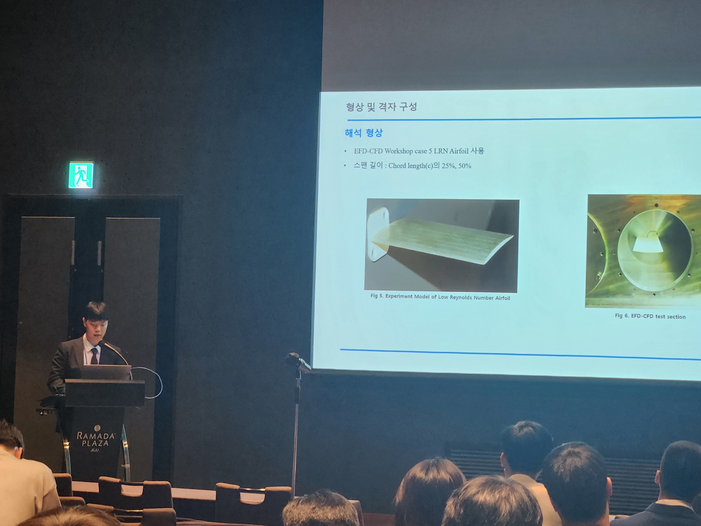
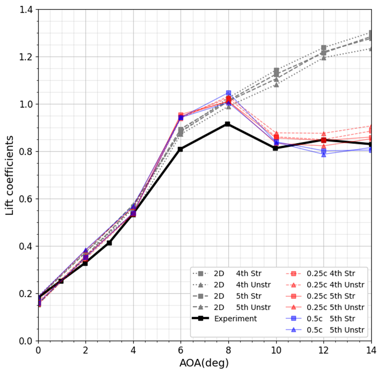
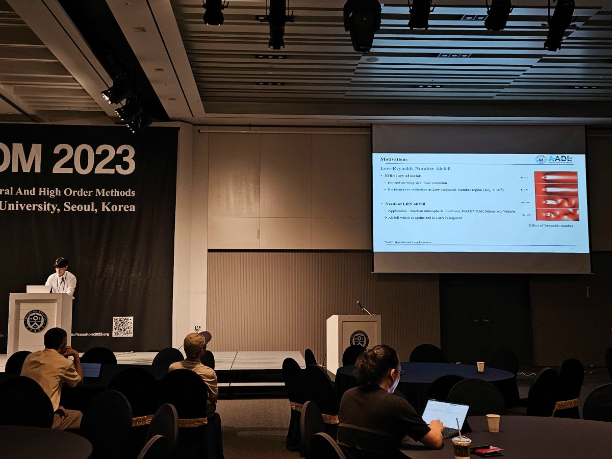
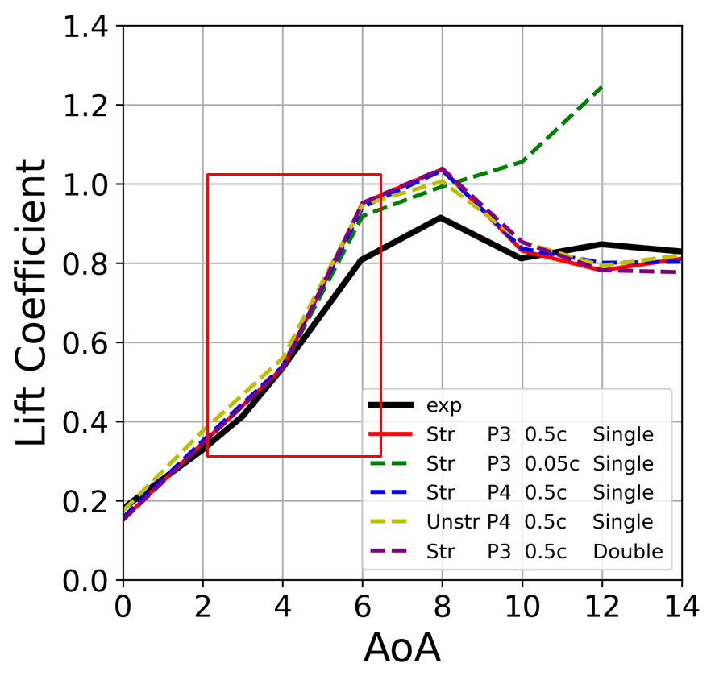
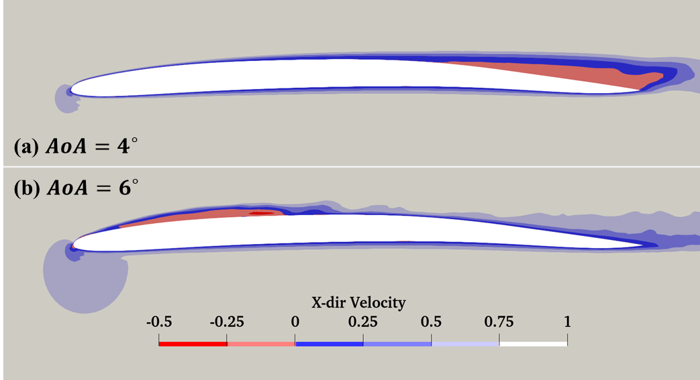
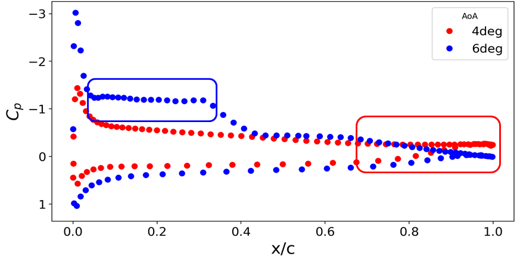
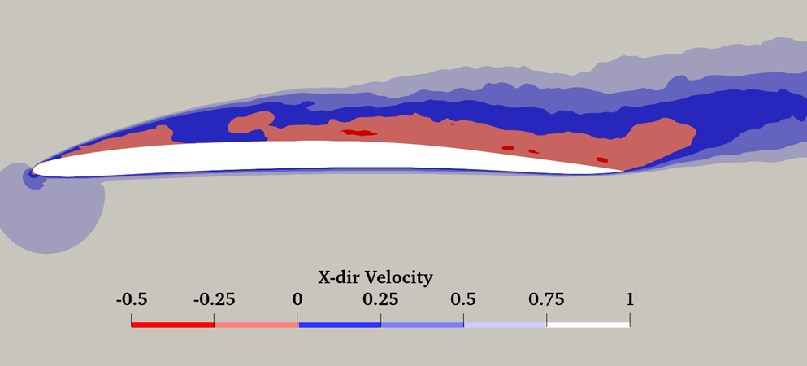

# Portfolio of MS course

> This page is the portfolio of Hyunbin Kang, a master's student at Inha University, Department of Aerospace Engineering, Aerodynamic Analysis and Design Lab.

# Profile

> **Name** : Hyunbin Kang
>
> **Major** : Computational Fluid Dynamics
> - High Order Methods
> - Hypersonic Aerodynamics
> - Panel Methods
>
> **Education**
> - Inha University, Department of Aerospace Engineering, Bachelor's Degree (2017-2022)
> - Inha University, Department of Aerospace Engineering, Master Course (2023-)
>
> **Email** : qls1455@gmail.com(personal), qls1455@inha.edu(education)
>
> **Office** : Inha University (Aerospace Campus), 36 Gaetbeol-ro, Yeonsu-gu Incheon 21999, Korea

# Projects

About the projects I was involved in during my Master's Course.

## 1. KSAS 2023 Spring conference talk

Korean Society for Aeronautical and Space Science

> ### Comparison of Flow Simulation over Low Reynolds Number Airfoil by Accuracy of PyFR
>
>> Intro : 
>> - In this study, aerodynamic investigation was conducted with Low Reynolds Number Airfoil of EFD-CFD workshop 5th case [*](https://efd-cfd.gitbook.io/efd-cfd-workshop/case-5-lrn-airfoil). 
>> - LRN airfoil has complex flow structure, so accurate computational is needed. 
>> - In this study, We utilze the PyFR, a aerodynamic analysis framework using Large Eddy Simulation (LES)
>
>> Results :
>>> Spanwise effect
>>> - Shorter spanwise length case has pool results of lift coefficients.
>>>     

>>>         
>>>          
>>>         <em> lift curve with several spanwise length </em>
>>>     

>>>
>>> - This result is caused by the 3-D effect of turbulent flow.
>>>     

>>>         
>>>          
>>>         <em> Q-criterion at angle of attack of 10 degree </em>
>>>     

>>
>>> Laminar Separation Bubble (LSB)
>>> - Low Reynolds number flow has a complex flow structure such as laminar separation, transition, reattachment etc.
>>> - This LSB reduce the aerodynamic performance.
>>> - LES can solve the LSB with high resolution.

## 2. ICOSAHOM 2023 conference talk

International Conference of Spactral and High Order Method

> ### Simulating Unsteady Flow over Low-Reynolds-Number Airfoil with Separation Bubble by PyFR
>
>> Intro : 
>> - Based on the previous study (KSAS), parametric study is conducted for numerical and computational condition.
>> - Paramters : spanwise length, order of accuracy, grid system, and precision
>
>> Results :
>>> Non-linearity
>>> - LSB's movement cause the non-linear aerodynamic characteristics
>>>     

>>>         
>>>          
>>>         <em> non-linearity of lift coefficient </em>
>>>     

>>>     

>>>         
>>>          
>>>         <figcation>
 time-averaged x directional velocity contour </em>
>>>     

>>>     

>>>         
>>>          
>>>         <em> time-averaged pressure coefficient distribution </em>
>>>     

>>
>>> Stall structure :
>>> - At high angle of attack region, LSB is genarated at leading edge of airfoil.
>>> - Since the strong separation can't recover the pressure, full separation from LE to TE is captured.
>>>     

>>>         
>>>          
>>>         <em> time-averaged x directional velocity contour at high angle of attack </em>
>>>     

>>
>> Discussion :
>>> effect of Spanwise length
>>> - We compared the result with (0.05, 0.1, 0.25, 0.5, 1.0) times of the chord length
>>> - Short span is limited in including 3-D effect
>>> - In high AoA region, spanwise length of 0.5 times of chord length is needed at least.
>>>
>>> effect of Order of accuracy
>>>
>>> - We performed the simulation with P2, P3, and P4 order with coarse, medium, and fine grid respectively
>>> - If the grid is fine near the surface and wake region, there are slight difference in the case of P2 order compared with P2 and P3 order.
>>> - The simulation with P2 coarse grid has inaccurate result. So lower order case has strong grid dependency.
>>>
>>> effect of Grid system
>>>
>>> - We constructed structured grid by PointWise and unstructured grid by Gmsh.
>>> - There are no sigmificant difference with two grid system.
>>> - However, there notable difference in computation time
>>> - Unstructured grid's minimum edge length and minimum cell volume is 4 and 13 times smaller than structured grid. So the computation time of unstr case is 9 times larger than the structured case.
>>>
>>> effect of precision
>>> - There are no siginficant difference with single and double precision(FP32 and FP64)

## 3. Teaching Assistant of Capstone Design

> ### Research on developing a variable wake model for panel program
>
>> Intro :
>> - Panel method is one of fast techniques of the aerodynamic analysis
>> - Panel method use the virtal wake panel to predict the lift
>> - When solving for high angle of attack condition, fixed wake model issues
>> - So variable wake model must be developed
>>
>>>
